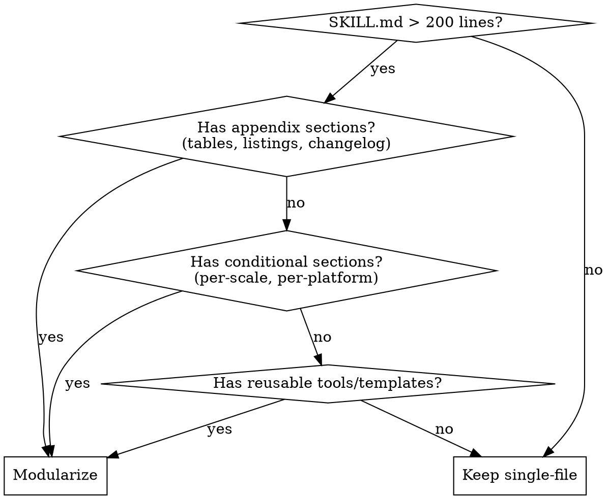

# Modulize Skill

## Overview

A SKILL.md that grows past 200 lines becomes harder to scan and burns tokens on irrelevant content. Modularization splits it into a main file with routing logic and separate sub-files loaded only when needed.

**Core principle:** The agent should read only what applies to their current task. Everything else is waste.

## When to Use



**Symptoms that your skill needs modularization:**
- Scrolling through appendix tables to find the core workflow
- Per-platform instructions that are irrelevant 2/3 of the time
- Template sections that are 50+ lines of boilerplate
- Quick reference table buried under conditional content

**Do NOT modularize when:**
- SKILL.md is under 100 lines (single-file is cleaner)
- All content is core workflow with no separable sections
- Content is purely procedural (instructions only)
- Splitting would create more navigation overhead than it saves

## Decision Framework

### Keep Inline (in SKILL.md)

| Content type | Threshold | Reason |
|-------------|-----------|--------|
| Core principles | Always | Every invocation needs these |
| Quick reference tables | < 20 lines | Scanning overhead is minimal |
| Code patterns | < 50 lines | Inline examples are easier to adapt |
| Common mistakes | Always | Must be seen to be avoided |
| Overview | Always | First thing agent reads |

### Split to Sub-File

| Content type | Directory | When to split |
|-------------|-----------|---------------|
| API reference tables | `references/` | 50+ lines of structured data |
| Command listings | `references/` | Comprehensive enumeration |
| Appendix / changelog | `references/` | Distracts from main flow |
| Per-scale guides | `guides/` | Only one scale applies per task |
| Per-platform guides | `guides/` | Only one platform applies |
| Per-mode guides | `guides/` | Only one mode is active |
| Templates | `templates/` | Reusable output structure |
| Scripts / tools | `scripts/` or `tools/` | Executable code |

## Directory Structure

Skill with conditional guides + appendix:

```
skill-name/
├── SKILL.md            # Overview, principles, routing table, common mistakes
├── references/         # Heavy reference (loaded on demand)
│   ├── api-reference.md
│   └── changelog.md
├── guides/             # Conditional (load only the matching one)
│   ├── solo.md
│   └── enterprise.md
└── templates/          # Reusable output
    └── template.md
```

Single appendix file (no subdirectory needed):

```
skill-name/
├── SKILL.md
└── appendix.md
```

**Naming conventions:**
- Subdirectories: `references/`, `guides/`, `templates/`, `scripts/`, `examples/`
- Never use `misc/`, `other/`, `extra/` — each directory has one clear purpose
- Single sub-files: describe what they contain (`appendix.md`, `api-reference.md`, `solo.md`)

## Cross-Referencing Conventions

### In SKILL.md: Routing Table

Use a markdown table that maps conditions to the sub-files agents should load. This is the **routing mechanism** — agents read the table, determine which condition applies, and load only those files.

```markdown
| Condition | Guide | Template |
|-----------|-------|-----------|
| Solo project | `guides/solo.md` | `templates/solo-template.md` |
| Small team | `guides/small-team.md` | `templates/team-template.md` |
| Enterprise | `guides/enterprise.md` | `templates/enterprise-template.md` |
```

For conditional loading by format/platform/mode, adapt the table:

```markdown
| Format | Guide | Appendix |
|--------|-------|----------|
| OpenAPI / REST | `guides/openapi.md` | `references/rest-templates.md` |
| GraphQL | `guides/graphql.md` | `references/graphql-patterns.md` |
| gRPC | `guides/grpc.md` | — (self-contained) |
```

### In SKILL.md: "Load ONLY" Directive

After the routing table, add an explicit instruction:

> **Load ONLY the guide and template for the condition you are working with. Do not load other conditional files — each is self-contained and the others are irrelevant.**

### In SKILL.md: Supplemental Files Section

Document the directory structure so agents know what exists:

```markdown
## Supplemental Files

This skill has additional content loaded on demand:

- `references/` — API reference tables, command listings, changelog
- `guides/` — Per-condition instructions (load only one)
- `templates/` — Reusable templates

Load only the files relevant to your current task. See the routing table above.
```

### In Sub-Files: "Related" Section

Every sub-file ends with back-references to the main SKILL.md and sibling files. Use backtick-quoted relative paths:

```markdown
## Related

- Main skill: `../SKILL.md` — overview and routing table
- Template: `../templates/solo-template.md`
```

**Never use markdown links** `[text](path.md)` for file references. Agents parse backtick-quoted paths as file locations, not web links.

## Modularization Process

### Step 1: Audit

Go through every section of the SKILL.md. Mark each as one of:

| Mark | Meaning | Action |
|------|---------|--------|
| **KEEP** | Core workflow | Stays in SKILL.md |
| **APPENDIX** | Reference material | Move to `references/` or `appendix.md` |
| **CONDITIONAL** | Per-scale / per-platform / per-mode | Move to `guides/` |
| **TEMPLATE** | Reusable structure | Move to `templates/` |

A section that is both conditional AND heavy reference? It goes in `guides/` (conditional takes priority). The difference: conditional content IS the instruction for that scenario; appendix content is reference data that supports any scenario.

### Step 2: Extract

Create subdirectories. Move content to sub-files. Each sub-file gets:
- A `# Title` matching the section it came from
- The extracted content (do not rewrite — just move)
- A `## Related` section at the bottom with back-references

### Step 3: Add Routing

In SKILL.md, replace the extracted sections with:
1. A routing table mapping conditions to sub-files
2. A "Load ONLY" directive after the table
3. A "## Supplemental Files" section documenting the structure

### Step 4: Self-Check

After modularizing, verify:
- [ ] An agent reading only SKILL.md can determine WHICH sub-files to load
- [ ] An agent reading a sub-file can find their way back to SKILL.md
- [ ] Conditional sub-files are self-contained (don't depend on other sub-files)
- [ ] No content exists in both SKILL.md and a sub-file (no duplication)
- [ ] Subdirectories have clear, single-purpose names

## Common Mistakes

| Mistake | Why it fails | Fix |
|---------|-------------|-----|
| **Splitting too early** | Under 100 lines, single-file is cleaner | Wait until SKILL.md exceeds 200 lines |
| **No routing table** | Agent doesn't know which sub-files to load | Add condition → file mapping table |
| **Missing "Load ONLY"** | Agent loads ALL sub-files, defeating the purpose | Add explicit load-only-this-file directive |
| **No back-references** | Agent in sub-file can't find main SKILL.md | Add `## Related` to every sub-file |
| **Conditional files depend on each other** | "Load only one" fails if they reference each other | Make each conditional file fully self-contained |
| **`misc/` or `other/` subdirectory** | No clear purpose, becomes dumping ground | Use `references/`, `guides/`, `templates/` only |
| **Leaving stubs in SKILL.md** | "See appendix for details" without routing info | Replace with routing table that tells agent WHERE and WHEN |
| **Rewriting content during extraction** | Introduces errors, loses provenance | Move first, improve later — never do both at once |

## Example: Before and After

### Before (monolithic, 421 lines)

```
documenting-apis/
└── SKILL.md          # Overview + workflow + OpenAPI guide + GraphQL guide
                      # + gRPC guide + quick reference + template appendix
                      # + common mistakes (421 lines, everything in one file)
```

An agent writing GraphQL docs loads 421 lines but only needs ~100 lines of GraphQL content. The OpenAPI and gRPC sections and template appendix are dead weight.

### After (modularized)

```
documenting-apis/
├── SKILL.md                  # Overview, workflow, routing table, common mistakes (~80 lines)
├── guides/
│   ├── openapi.md            # REST/OpenAPI instructions + anti-patterns
│   ├── graphql.md            # GraphQL instructions + anti-patterns
│   └── grpc.md               # gRPC instructions + anti-patterns
└── references/
    └── doc-templates.md      # Getting started, auth, endpoint, error templates
```

Agent writing GraphQL docs:
1. Reads SKILL.md (80 lines) → routing table says `guides/graphql.md`
2. Loads `guides/graphql.md` (~60 lines)
3. If they need a template, routing table points to `references/doc-templates.md`

Total: ~140 lines loaded vs 421. And the agent never sees irrelevant OpenAPI or gRPC content.
